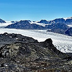

# 🧠 Intel Image Classification with CNN 🌐

Welcome to an intelligent image classification project built with **Convolutional Neural Networks (CNN)** and deployed with **TensorFlow.js**! 🚀 This project can classify outdoor scene images like **buildings**, **mountains**, **forest**, and more using deep learning.

## 🌟 Features
- Built with TensorFlow
- Custom CNN architecture
- Augmented training using `ImageDataGenerator`
- Supports early stopping and `ReduceLROnPlateau`
- Evaluates model with detailed classification report
- Exported to TFLite format for inference

---

## 🖼️ Sample Images
| Buildings | Forest | Street |
|----------|--------|--------|
|  |  |  |

---

## 🚀 How to Run

### Clone this Repository
```bash
git clone https://github.com/your-username/intel-image-classification.git
cd intel-image-classification
```

## 🛠️ Tools & Libraries
- TensorFlow / Keras
- TensorFlow.js
- NumPy, Pandas
- Matplotlib
- OpenCV
- scikit-learn

## 📂Structure Folder
```
├───intel-image-classification    # Dataset Folder
│   ├───inference 
│   ├───test
│   │   ├───buildings
│   │   ├───forest
│   │   ├───glacier
│   │   ├───mountain
│   │   ├───sea
│   │   └───street
│   ├───train
│   │   ├───buildings
│   │   ├───forest
│   │   ├───glacier
│   │   ├───mountain
│   │   ├───sea
│   │   └───street
│   └───val
│       ├───buildings
│       ├───forest
│       ├───glacier
│       ├───mountain
│       ├───sea
│       └───street
├───saved_model                  # Model Saved Folder
|   ├───fingerprint.pb
│   ├───saved_model.pb
│   ├───assets
│   └───variables
|          variables.data-00000-of-00001
│          variables.index
├───tfjs_model                   # Model TensorFlow Js Folder
|       group1-shard1of7.bin
│       group1-shard2of7.bin
│       group1-shard3of7.bin
│       group1-shard4of7.bin
│       group1-shard5of7.bin
│       group1-shard6of7.bin
│       group1-shard7of7.bin
│       model.json
├───tflite                       # Model TFLite Folder
│   ├───cnn_model.tflite
|   ├───label.txt
├───cnn_model.h5
├───README.md
├───Proyek-Image-Classification.ipynb
└───requirements.txt
```
## **📊Classification Report:**
- Akurasi total: 89%
- Kinerja per kelas:
1. Forest: performa terbaik (Precision: 96%, Recall: 98%)
2. Buildings & Sea: cukup baik (F1-score sekitar 87–90%)
3. Mountain & Glacier: performa lebih rendah (F1-score ~85–86%)
4. Macro Avg F1-score: 89% (rata-rata antar kelas)
5. Weighted Avg F1-score: 89% (mempertimbangkan jumlah data per kelas)
